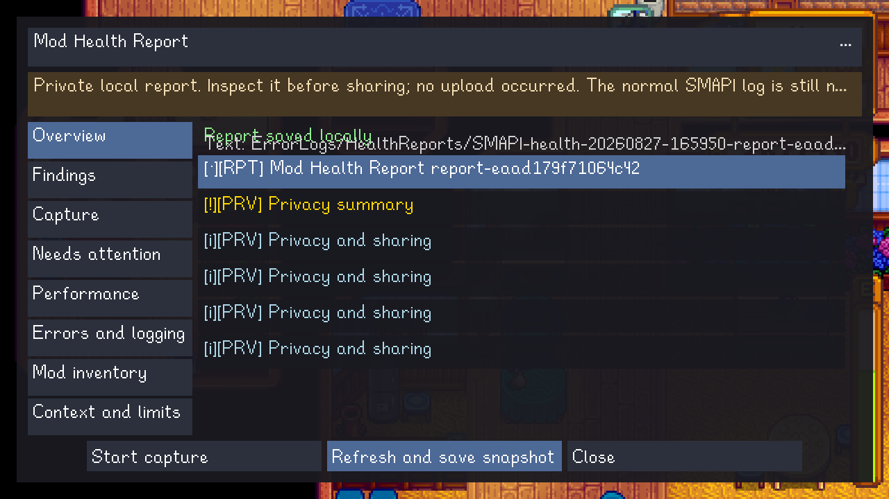

# SMAPI — Linux Performance Fork

An unofficial Linux desktop fork of [SMAPI](https://github.com/Pathoschild/SMAPI), tuned for large
Stardew Valley mod collections. It keeps SMAPI's familiar mod-loading and API surface while reducing
avoidable framework work and adding private, local tools for finding slow or unhealthy mods.

> [!IMPORTANT]
> This is a development fork, not an official SMAPI release. It currently has no tagged player
> download. Most players should install [official SMAPI](https://smapi.io/) unless they specifically
> want to evaluate this fork on Linux and are comfortable building and testing development code.

## At a glance

| | Official SMAPI | This fork |
| --- | --- | --- |
| Best for | Most players and mod authors | Linux players testing very large mod sets |
| Platforms | Official Windows, macOS, and Linux support | Linux desktop is the tested project focus |
| Current base | SMAPI 4.5.2 | SMAPI 4.5.2 plus Linux-focused changes |
| Player diagnostics | Console and standard log | Standard tools plus `health` and `performance` reports |
| Releases | Published tagged releases | No tagged release yet |
| Support | Official SMAPI community | This repository's issue tracker |

The fork audit currently tracks **95 performance and correctness findings**. Its main themes are
incremental world/inventory tracking, lower-allocation input and event paths, faster asset routing,
less repeated map work, bounded performance diagnostics, and a private in-game Mod Health Report.

## Measured comparison

One historical same-machine comparison used a 308-mod Linux workload and a mid/late-game save. Each
steady-state sample ran for 180 seconds with external instrumentation around SMAPI, the game update,
and mod handlers.

| Metric | Stock SMAPI 4.5.1 | Fork build | Observed change |
| --- | ---: | ---: | ---: |
| Mean SMAPI framework overhead per tick | 5.892 ms | ~0.149 ms | **97.5% lower** |
| p95 SMAPI framework overhead per tick | 7.201 ms | 0.196 ms | **97.3% lower** |
| Allocation per tick | 4,787 KB | 959 KB | **80.0% lower** |
| `SGame.Update` + `Draw` per frame | 14.696 ms | 6.785 ms | **53.8% lower** |

These are results from one machine, modpack, save, and historical stock 4.5.1 baseline—not a promise
of the same FPS or latency improvement on every system. See the
[full comparison and methodology](https://4eh5xitv6787h645ebv.github.io/SMAPI/upstream-comparison.html)
for hardware details, current-version caveats, and isolated benchmark results.

## What this fork adds

### Lower overhead for large mod sets

- Event-driven chest, inventory, skill, and location tracking replaces repeated full-world polling.
- Content invalidation and propagation batch or index repeated work.
- TMX parsing, tile conversion, image patches, JSON loading, and path routing avoid known duplicate
  CPU work and temporary allocation.
- Assembly parsing and compatibility-rewrite results are reused when safe.

### Mod Health Report

Use `health start`, reproduce a problem, then use `health stop` and `health view`. The local report
organizes load failures, repeated errors, timing evidence, and data limitations without uploading
anything.

[Open the illustrated Mod Health Report guide →](https://4eh5xitv6787h645ebv.github.io/SMAPI/mod-health-report.html)

### Opt-in performance diagnostics

Run `performance start`, reproduce a slowdown, and then run `performance stop`. The bounded report
ranks work observed at SMAPI-managed callbacks and separates game update time, observed callbacks,
SMAPI-owned update dispatch, and unattributed residual time. Profiling is disabled by default.

## Start here

- [Read the new documentation site](https://4eh5xitv6787h645ebv.github.io/SMAPI/)
- [Compare official SMAPI and this fork](https://4eh5xitv6787h645ebv.github.io/SMAPI/upstream-comparison.html)
- [Evaluate the fork safely](https://4eh5xitv6787h645ebv.github.io/SMAPI/getting-started.html)
- [Review the full performance audit](docs/technical/linux-large-mod-performance-audit.md)
- [Report a fork issue](https://github.com/4eh5xitv6787h645ebv/SMAPI/issues)

For normal installation help, modding documentation, compatibility information, and community
support, use the [official SMAPI website](https://smapi.io/) and
[player guide](https://stardewvalleywiki.com/Modding:Player_Guide).

## Project scope

This repository focuses on native Linux desktop SMAPI. Android/mobile is out of scope. The fork is
derived from upstream SMAPI and remains licensed under the terms in [LICENSE.txt](LICENSE.txt).
SMAPI and Stardew Valley belong to their respective authors; this repository is not affiliated with
ConcernedApe or the official SMAPI maintainers.
