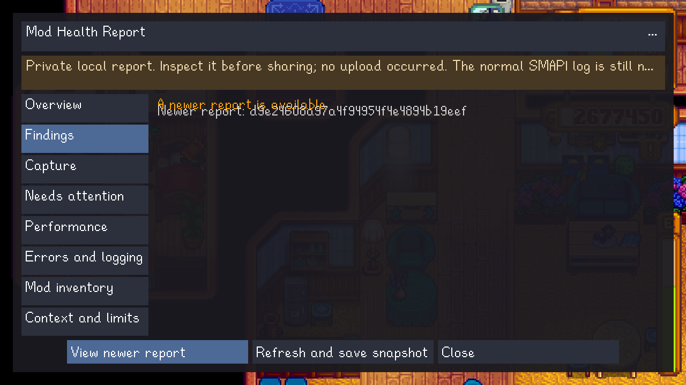
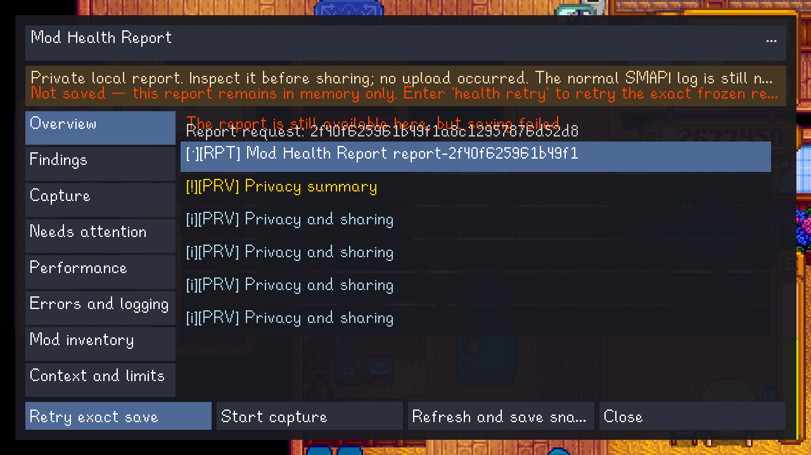
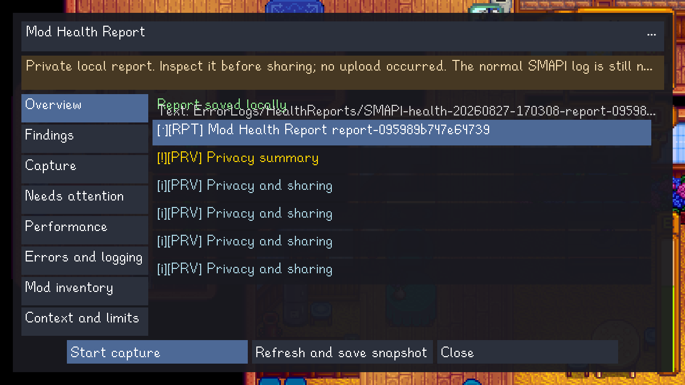

# Mod Health Report guide

The Mod Health Report is a private, local diagnostic for Linux desktop SMAPI. It summarizes mod
loading problems, repeated errors, slow updates, and the limits of the evidence SMAPI collected.
It doesn't upload anything or change your mods, saves, or settings.

> [!IMPORTANT]
> Reports include mod names, IDs, versions, dependency IDs, callback identities, and statuses.
> Inspect a report before sharing it. The normal SMAPI log is still needed for full exception
> details.

## Quick start

Enter commands in the SMAPI console while the game is running.

To open a quick report based on the current session ledger:

```text
health view
```

For a timed report:

```text
health start
```

Reproduce the problem in-game, then optionally enter `health mark` at the moment it happens. When
you're finished, enter:

```text
health stop
health view
```

`health report` saves an interim snapshot without stopping an active capture. `health status`
shows the current ledger, capture, capacity, and export state.

## Normal saved report

The privacy notice remains at the top of the viewer. The left side contains eight sections, and
the main panel contains only the sanitized frozen report model. Saved paths are relative to the
Stardew Valley data folder instead of exposing an absolute home or game path.


The sections are:

| Section | What it shows |
| --- | --- |
| Overview | Save state, privacy summary, report identity, and high-level results. |
| Findings | Prioritized findings, evidence, suggested actions, and limitations. |
| Capture | Whether the report is ledger-only or timed, sample quality, marks, and omissions. |
| Needs attention | Mods which failed, were skipped, or otherwise need review. |
| Performance | Slow updates and bounded timing evidence when a valid timed capture exists. |
| Errors and logging | Sanitized counts and identities, without raw log messages or stack traces. |
| Mod inventory | The bounded installed-mod inventory included in the report. |
| Context and limits | Environment context, completeness boundaries, and interpretation limits. |

Select a row to open its details. Use the persistent privacy and status actions when you need the
expanded explanation.

## Controls

| Input | Controls |
| --- | --- |
| Mouse | Click rows and actions; use the wheel to scroll. |
| Keyboard | Arrow keys move focus; Page Up/Down and Home/End page; Tab changes focus; Enter activates; `I` expands status; `P` expands privacy; Escape backs out or closes. |
| Controller | D-pad moves focus; shoulders change sections; A activates; X expands privacy; Y expands status; B/back backs out or closes. |

Escape and controller B close row details or expanded text before closing the viewer. The visible
**Close** action closes the viewer directly.

## When a newer report is ready

The viewer stays tied to the exact report you opened. It never silently swaps in newer evidence.
If an interim or final report becomes available, select **View newer report** to switch explicitly.



## If saving fails

A write failure doesn't discard the frozen report or crash the game. The viewer labels the report
as memory-only and keeps the exact model available for retry.



Fix the storage problem if possible, then select **Retry exact save** or enter:

```text
health retry
```

The retry uses the same frozen evidence; it doesn't rebuild the report from newer session data.
After success, the viewer changes to **Report saved locally** and shows the relative text and JSON
paths.



Use `health reset confirm` only when you intentionally want to discard timed evidence and any
failed retry. The session-wide ledger is kept.

## Storage and privacy

Reports are stored under `ErrorLogs/HealthReports` in the Stardew Valley data folder. Each complete
report has text, JSON, and completion-marker files. SMAPI keeps at most five complete report pairs
and removes pairs older than 30 days.

The report intentionally excludes raw logs and stack traces, absolute paths, save/farm/player
data, multiplayer identities and addresses, command history, chat, mod descriptions and authors,
update keys and URLs, mod configuration, usernames, hostnames, and machine IDs. The viewer doesn't
upload, copy to the clipboard, launch a browser or file manager, or browse old reports from disk.

`health view` only opens a report prepared during the current SMAPI process. Close another in-game
menu before opening it. Labels fall back to English when a translation is unavailable, and the
schema-v1 finding text remains canonical English.

For implementation details, see the [technical plan](technical/mod-health-report-plan.md) and
[validation record](technical/mod-health-report-validation.md).
