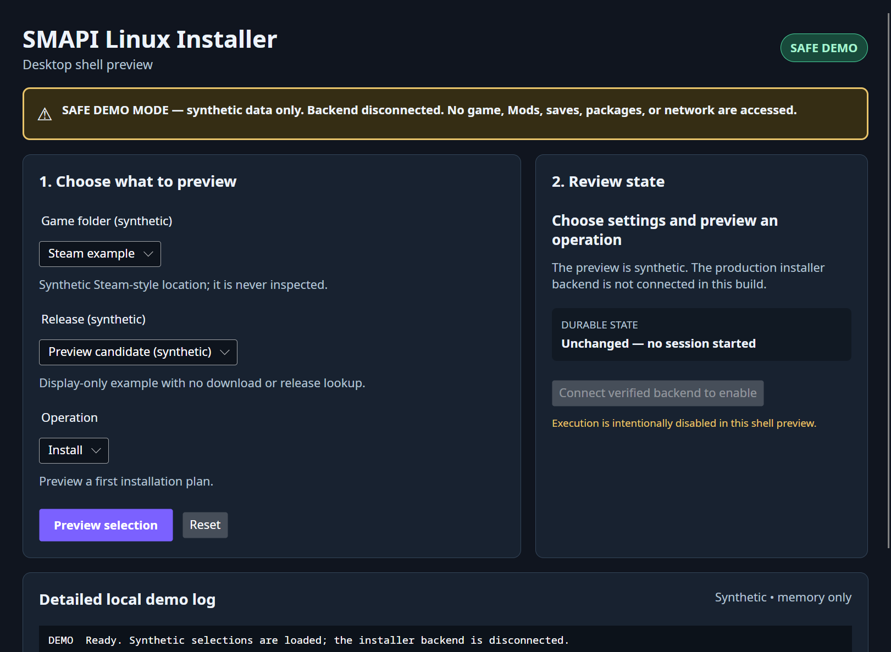

# Linux graphical installer shell

The Linux desktop frontend is an Avalonia application around the shared Core protocol behavior; it
does not copy filesystem ownership or mutation rules into the UI. The repository now contains both
the original sealed safe-demo mode and the separately reviewed production workflow for release
verification, game discovery, plan review, execution, rollback, interrupted recovery, and
recovery-history cleanup.

The screenshot below is **historical safe-demo evidence**, not the production installer. Exact `--demo` still uses deterministic synthetic folder and release options, holds its app log in memory, does not connect the production backend, and performs no installer-controlled game/package discovery or mutation and no app-initiated download or network request. Its execute control is intentionally disabled; previewing an operation never claims it completed.

Avalonia and the operating-system desktop stack still make their normal infrastructure accesses. Depending on the session, those can include X11, D-Bus/AT-SPI, fonts, and Mesa or toolkit caches. The safety boundary here is the absent installer backend and fixed synthetic app data, not a claim that the GUI process makes no system calls or reads/writes no runtime state.



[Review the exact source, capture environment, checksum, and privacy record for this screenshot.](../screenshots/linux-installer-safe-demo.provenance.html)

## Build and run on Linux

Install the .NET 10 SDK and the normal desktop libraries required by Avalonia for your distribution. From the repository root:

```sh
dotnet restore src/SMAPI.Installer.Gui/SMAPI.Installer.Gui.csproj
dotnet build src/SMAPI.Installer.Gui/SMAPI.Installer.Gui.csproj --configuration Release --no-restore
dotnet run --project src/SMAPI.Installer.Gui/SMAPI.Installer.Gui.csproj --configuration Release --no-build -- --demo
```

The supported first desktop path is X11, including XWayland on Wayland sessions; Avalonia's experimental native Wayland path isn't advertised as supported yet. The window uses native controls, unique access keys and an explicit forward/reverse tab order, a visible focus ring, automation headings and a concise live result, and device-independent sizing. Selection and state cards stack below 850 device-independent pixels; the page remains vertically scrollable without horizontal page scrolling at the tested 100%, 125%, 150%, and 200% scale models.

The GUI follows the desktop's light or dark theme by default, including live theme changes. For an
explicit maximum-contrast presentation, launch the same package as your normal desktop user with
`SMAPI_INSTALLER_HIGH_CONTRAST=1`; for example:

```sh
SMAPI_INSTALLER_HIGH_CONTRAST=1 bash "install on Linux (graphical).sh"
```

Only the exact value `1` enables this override. It changes presentation colors and focus/error
outlines only: it doesn't grant installer authority, bypass verification or confirmation, alter
diagnostics, or require `sudo`. Remove the variable (or set any other value) to follow the system
theme again. The light, dark, and explicit high-contrast palettes have automated checks for visible
keyboard focus, error text/boundaries, and the manual terminal-help card. Real GNOME/KDE,
X11/XWayland, AT-SPI, and scaling capture work remains pending in the exact-package desktop matrix.

## Use the production workflow

Close Stardew Valley and back up saves and `Mods` before beginning. From one complete verified
public package, run `bash "install on Linux (graphical).sh"` as the normal desktop user. The GUI is
deliberately staged; reaching a later screen never means an earlier read-only action changed files.

1. **Verify a release.** Choose a reviewed public prerelease and select **Download and verify**, or
   choose **Use local package folder…** and freshly select one folder containing the exact six
   release files. Integrity and GitHub provenance are separate visible results. A failed or cancelled
   check authorizes no game discovery or mutation.
2. **Choose the game.** Review automatically detected folders, or use **Browse for game folder** for a
   manual selection. Validation is read-only. Continue with **Review plan** only after the folder is
   reported as valid.
3. **Inspect one operation.** Select **Install**, **Update**, **Repair**, **Uninstall**, or **Backup**,
   then choose **Inspect plan**. The plan shows observed state, authenticated current/target release
   relationship, exact operations, risks, and conflicts. If modified receipt-owned files are
   eligible for replacement, every additive approval starts unchecked; there is no Select all.
   Applying those choices only refreshes the read-only plan.
4. **Confirm, then run.** **Confirm reviewed plan** still changes no files and opens a separate final
   screen. Recheck the safety boundary, leave Cancel selected if anything is unexpected, and use the
   explicit **Run operation** action once, or **Run rollback** for an inspected rollback. Do not start
   the game, replace the selected folder, or run another
   installer while a mutation is active. The final screen distinguishes the durable result from
   backend-settlement warnings and offers recovery when the exact recorded state requires it.

Operation-specific expectations:

| Operation | When to use it | What to verify in the read-only plan |
| --- | --- | --- |
| Install | No managed fork installation is present. | A fresh target release, launcher handling, created files, and no unresolved collision. |
| Update | A receipt-authenticated fork installation should move to the verified target. | Current and target releases, upgrade or explicit downgrade risk, retained unrelated files, and every requested replacement. |
| Repair | The receipt-authenticated target release has missing or modified managed files. | Missing files to restore; modified files remain blocked unless individually approved. |
| Uninstall | Remove receipt-owned SMAPI files and restore the observed launcher where possible. | Destructive removal list, launcher restoration, and preserved unrelated game files, Mods, saves, and reports. |
| Backup | Create a user checkpoint of the authenticated managed installation. | The checkpoint source release and bounded receipt-owned contents; it is not a backup of Mods or saves. |
| Rollback | Restore one exact authenticated recovery generation. | Use **Load or refresh history**, select one point, and **Inspect rollback**. No point is selected automatically. Confirm only after reviewing the restored release/state and downgrade risk. |

If startup detects an interrupted mutation, follow the offered authenticated recovery before asking
for a fresh plan. Recovery preparation can be cancelled while that action remains visible; after the
backend admits recovery, it must settle and is no longer cancellable. Recovery history cleanup is
also a separate reviewed flow: select generations individually, preview cleanup,
confirm with Cancel focused by default, and then run it. The sanitized diagnostic viewer is useful
for safe next steps, but the local private log and every displayed path or report should still be
reviewed before sharing.

Run the focused tests with:

```sh
dotnet test src/SMAPI.Installer.Gui.Tests/SMAPI.Installer.Gui.Tests.csproj --configuration Release
build/scripts/test-linux-gui-demo-smoke.sh
```

The tests cover the disconnected view model, synthetic session invariants, fixed display bounds and control/bidirectional-character rejection, exact Core operation coverage, launch argument safety, real access-key and Tab/Shift+Tab invocation, automation names/headings/live status, disabled execution, contrast, and arranged/rendered layouts at the scale models and narrow viewport. The process smoke runs the built shell for five seconds under Xvfb with disposable `HOME` and XDG directories; it isn't a general operating-system sandbox or a substitute for the later installer integration tests.

<a id="private-diagnostics-and-troubleshooting"></a>

## Local diagnostics and troubleshooting

Every production workflow screen in the current source has a **View diagnostic snapshot** action.
It opens one immutable, bounded, read-only sanitized capture of the current graphical-installer
session. The viewer labels snapshot health and separately reports displayed entries, entries omitted
from the display window, entries omitted from the private raw log, and intermediate events
coalesced by the bounded queue. A successful installer terminal is identified by an exact stable
event such as `execution.terminal.succeeded`; cancellation, rollback, cleanup-warning,
recovery-required, recovery, and failure outcomes have distinct stable event codes and truthful
information, warning, or error severity. The fixed message also names the operation, durable state,
and safe next action without using a path, identifier, backend message, or exception.

The snapshot is captured when the window opens, so close and reopen it to include later events.
**Copy sanitized diagnostics** writes that exact bounded snapshot to the clipboard only after an
explicit action; the installer never reads clipboard contents. If the desktop has not confirmed the
write, the viewer leaves Copy disabled after a three-second deadline and reports that the original
write may still finish. Closing and reopening cannot start another write until that original
provider settles; after it settles, a fresh explicit Copy attempt is available.

Keyboard shortcuts are consistent across the production flow: Alt+D opens diagnostics, Alt+Y
copies the sanitized snapshot, and Alt+X or Escape closes the viewer. On release verification,
Alt+W starts **Download and verify**. Closing the viewer restores focus to **View diagnostic
snapshot**.

The production GUI creates its private log before Avalonia, catalog networking, game discovery, or
backend startup. On Linux it uses `$XDG_STATE_HOME/smapi-installer/logs` when `XDG_STATE_HOME` is an
absolute path, or `~/.local/state/smapi-installer/logs` otherwise, with mode-`0700` directories and
mode-`0600` files. Each raw JSONL file is at most 1 MiB; the writer retains no more than five owned
files or 5 MiB total and rotates older owned logs when the next session starts. The viewer never
shows or opens the resolved raw-log path. The on-screen snapshot is intentionally narrower than the
local JSONL log:
it excludes local paths, URLs, credentials, backend prose, release/package identifiers, digests,
and private workload names. Review even the sanitized snapshot before sharing it. Neither surface
is uploaded automatically. The raw log is not claimed safe to share merely because the snapshot is
sanitized; review it separately.

Common safe next steps are:

| Symptom | Safe next step |
| --- | --- |
| The launcher refuses root or `sudo` | Run it again as the normal desktop user. No diagnostic log, network request, or game access starts on the refused path. |
| No compatible graphical release is listed | Check connectivity and confirm the catalog is showing this repository's published alpha 2. Do not substitute an Actions or pull-request artifact. You can freshly select the downloaded six-file folder or use the terminal fallback. |
| Catalog, download, or verification fails | Retry from the visible action after checking connectivity. A failed verification does not authorize game-file mutation. |
| The backend or protocol session fails | Close the GUI, review the private diagnostic snapshot, and start a fresh session. The GUI does not reconstruct backend authority after a failed session. |
| Diagnostic logging cannot start or cannot prove readiness | Close any other graphical installer session. Do not remove its lock, use root, or loosen file permissions broadly. Check free space and that the normal user owns the XDG state location, then start a fresh session. New mutating work remains blocked when readiness cannot be recorded. |
| The native Wayland path does not start reliably | Use an X11 or XWayland session, or use the retained terminal launcher. Native Wayland remains experimental. |

## Console and headless fallback

The same published alpha 2 package retains the legacy `install on Linux.sh` console launcher. It is
useful in a terminal, headless environment, or native-Wayland-only session, but it is not a text
version of the graphical Core workflow.

Before either console route, close the game, back up saves and `Mods`, download the complete six-file
release set into one new directory, and complete the checksum and GitHub-attestation procedure in the
[Linux alpha release guide](linux-alpha-release.md#verify-before-extracting-or-running). Verify the
outer installer ZIP before extracting it. The console installer does not repeat those release checks.
After verification, extract the ZIP into a new directory and run this as the normal desktop user:

```bash
cd "/path/to/extracted/SMAPI installer"
bash "install on Linux.sh"
```

Never use `sudo`. In an existing terminal the script runs the packaged installer and returns its exit
status. In the published alpha 2, the wrapper does not forward command-line options; the current
unreleased source instead rejects any supplied option with status 2. In either version, use the
direct apphost commands below for headless operation. When opened through a file manager it may
only report whether a supported terminal emulator was launched, so automation should invoke the
apphost directly. In the interactive flow, choose readable terminal colors, select or enter the
folder containing `Stardew Valley.dll`, choose only **Install** or **Uninstall**, and wait for the
explicit success message. Do not treat folder detection or the start of copying as success.

A genuinely prompt-free install or uninstall needs one action and an absolute validated game path:

```bash
cd "/path/to/extracted/SMAPI installer"
./internal/linux/SMAPI.Installer \
  --no-prompt --install --game-path "/absolute/path/to/Stardew Valley"

# Or remove the legacy install:
./internal/linux/SMAPI.Installer \
  --no-prompt --uninstall --game-path "/absolute/path/to/Stardew Valley"
```

Exit `0` means the requested legacy install or uninstall reached its normal success return. Exit `2`
means a known validation path returned false, including root use, missing package files, conflicting
install/uninstall flags, a missing required action or option value, or an invalid game folder. The
current unreleased source also fails closed with status 2 when `--no-prompt` has no `--game-path`;
that safeguard is not retroactive to alpha 2, so always use the complete commands above. Unknown or
positional arguments are ignored by the direct apphost.
Exit `1` means an unexpected exception, filesystem failure, or runtime failure escaped the legacy
flow. Shell and signal exits can produce other statuses. Exit `1` or a signal can occur after direct
mutation began; no exit status alone proves unchanged state or successful rollback. Treat every
nonzero result as failure and inspect the folder before launching or retrying. Console output can
contain the selected game path and full exception text, so review it before sharing.

The legacy path supports only install and uninstall. Install first removes its hard-coded list of
known SMAPI files and then copies the new payload; running Install again is not a receipt-authenticated
**Update** or **Repair**. It has no GUI/Core read-only plan, per-file conflict approval, installed
receipt, transaction journal, automatic rollback, interrupted-operation recovery, authenticated
history, backup operation, or authenticated rollback. A failure after mutation begins can leave a
partial installation. Preserve `StardewValley-original` and your backups, avoid ad-hoc deletion, and
inspect or restore the folder before retrying.

Raw extraction of `internal/linux/install.dat` is a last-resort fresh-install procedure, not a third
equivalent frontend. It offers none of the transactional protections above. Never recursively delete
the game directory, `Mods`, saves, `ErrorLogs`, `HealthReports`, or other user data. Follow the
version-specific steps and collision stops in the
[manual installation section](linux-alpha-release.md#manual-installation-path).

## Current boundary and packaging status

The view model accepts only the exact internal sealed `DemoInstallerFrontendSession` type. Its fixed constants are bounded and validated against control, bidirectional-format, and surrogate characters. It returns only synthetic choices and an unchanged durable state without touching operating-system services. There is no public extension point which can be mistaken for a reviewed production authority boundary.

Production GUI composition connects reviewed release acquisition to the exact packaged sibling
backend's private protocol mode and transfers single-owner authorities through discovery, plan
review, explicit confirmation, execution, rollback, interrupted recovery, and recovery-history
cleanup. That route leaves path ownership, trust, confirmation, transactions, backup, rollback, and
recovery policy in Core. The console/headless and raw-extraction fallbacks described above do not.

The published alpha 2 adds the self-contained GUI while retaining the existing console launcher in
the same exact verified ZIP. Production creates a bounded private
diagnostic session before desktop or network startup and exposes its sanitized snapshot from every
workflow screen. It can select reviewed public releases or import one freshly selected local folder
containing the exact six release files; both routes reach the same authenticated package authority.
Installed/current, upgrade, and downgrade relationships are shown only after the selected game and
its receipt have been inspected, never inferred from an unauthenticated catalog label.

The corrected alpha 3 source is still a non-public candidate. Its planned embedded version is
`4.5.3-unofficial.4eh5xitv6787h645ebv.linux.alpha.3` and its reserved annotated tag is
`fork-4eh5xitv6787h645ebv-linux-v4.5.3-alpha.3`; neither is a public-package claim. Alpha 2 remains
the current download until the candidate is merged, qualified, tagged, published, freshly
downloaded, independently verified, and exercised with the authorized trusted workload.

For alpha 2, the exact reviewed source, tagged release workflow, six public assets, fresh
public-download verification, packaged GUI smoke, and disposable
install/update/uninstall/failure lifecycle passed. Its exact-source merge candidate also passed the
authorized trusted workload, but the tag workflow rebuilt the public ZIP and byte-for-byte
reproducibility is not claimed; the public ZIP is not described as having run that private
workload. The historical safe-demo screenshot is still not production evidence. Genuine GNOME/KDE,
X11/XWayland, AT-SPI, scaling, and the complete authenticated production screenshot set remain
pending. See the
[sanitized public qualification record](https://github.com/4eh5xitv6787h645ebv/SMAPI/issues/168#issuecomment-5515036792).
